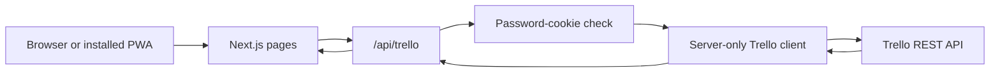

# Dmdash current state

Last updated: 2026-09-06

## Purpose

Dmdash gives one command-board view of work from multiple Trello boards. It does not copy Trello data to another database. All card reads and writes go through the controlled Trello MCP service.

## System flow

The browser never receives the Trello API key or token. The server adds these values to Trello requests.

## Source of truth

Trello is the only source of truth.

| Dmdash term | Trello object |
|---|---|
| Project | Board |
| Workflow stage | List |
| Work item | Card |
| Classification | Label |
| Notes | Card description |
| Steps | Checklist items |

Dmdash has no application database. It has no Airtable path and no GitHub issue path.

## Board selection

Dmdash reads all open boards for the Trello member. A board enters Dmdash when it has at least one recognized workflow list.

The standard lists are:

1. 2do
2. Next Up
3. Working
4. Waiting
5. Done

The app also accepts these aliases:

| Standard stage | Accepted list names |
|---|---|
| 2do | 2do, To Do, Todo, Backlog |
| Next Up | Next Up, Next |
| Working | Working, In Progress, Doing |
| Waiting | Waiting, Blocked |
| Done | Done, Complete, Completed |

If a board has two lists that map to the same stage, Dmdash uses the first matching open list. Cards in other lists do not appear.

## Read flow

1. The browser calls `GET /api/trello`.
2. The server reads all open Trello boards for the configured member.
3. For each board, the server reads its open lists and open cards.
4. The server maps recognized lists to Dmdash workflow stages.
5. The server returns boards, visible cards, missing workflow stages, and the synchronization time.
6. The browser refreshes after each write, when focus returns, and every 90 seconds while visible.

## Write flow

| Dmdash action | HTTP request | Trello change |
|---|---|---|
| Create card | `POST /api/trello` | Create a card in the selected list |
| Edit card | `PATCH /api/trello` | Update the card name or description |
| Move or reorder | `PATCH /api/trello` | Change the list or card position |
| Complete | `PATCH /api/trello` | Move the card to Done |
| Restore | `PATCH /api/trello` | Move the card to Next Up |
| Archive | `DELETE /api/trello` | Close the Trello card |

Archive is recoverable in Trello. Dmdash does not permanently delete cards.

## Authentication and environment

The server uses these variables:

| Variable | Required | Purpose |
|---|---|---|
| `TRELLO_MCP_URL` | Yes | Identifies the Trello MCP endpoint |
| `TRELLO_MCP_TOKEN` | Yes | Authenticates Dmdash to the Trello MCP service |
| `APP_PASSWORD` | No | Enables the single-password application lock |

Keep all three variables on the server. Do not use a `NEXT_PUBLIC_` prefix.

When `APP_PASSWORD` is empty, the application lock is disabled. When it is set, a successful login creates an HTTP-only cookie.

## Runtime files

| Path | Responsibility |
|---|---|
| `src/components/Board.tsx` | Board UI, filters, dialogs, drag-and-drop, and refresh behavior |
| `src/app/api/trello/route.ts` | Authenticated Trello read and write API |
| `src/lib/trello.ts` | Trello REST client and workflow mapping |
| `src/lib/route-input.ts` | API input parsing and validation |
| `src/lib/types.ts` | Trello command-board types |
| `src/lib/auth.ts` | Password and cookie token logic |
| `src/lib/guard.ts` | Page and API authentication checks |
| `src/components/SettingsForm.tsx` | Connection status and workflow help |
| `.github/workflows/verify.yml` | Tests and build checks for pull requests and `main` |

## Technology baseline

- Next.js 16.3.1
- React and React DOM 19.2.8
- TypeScript 7.0.2
- dnd-kit Core 6.3.1 and Sortable 10.0.0
- Node.js 24 LTS

## Verification status

The automated test suite and production build passed on 2026-08-27 with Node.js 24.18.0.

The test suite covers workflow aliases, board selection, Trello card conversion, checklist totals, missing workflow lists, and API input validation.

A live acceptance test passed on 2026-08-27. It verified card creation, editing, movement, reorder requests, completion, restore, project notes, refresh, and archive cleanup against Trello.

The Vercel production deployment passed on 2026-08-27. The production login and live Trello read passed at `https://dash.davidmarlowe.com`.

Vercel uses its native Next.js output. Other Node hosts and containers use Next.js standalone output. Vercel Preview and Production contain the three required server-side variables.

GitHub Actions passed all 17 tests and the production build for commit `431cc26`.

On 2026-09-06, the Trello MCP service returned `Trello request failed (401): invalid key`. The same failure occurred with the local Worker credentials. The Worker needs a valid `TRELLO_API_KEY` and `TRELLO_TOKEN` before board reads and writes can operate.

Dmdash now returns safe MCP error text to the user. The test suite contains 19 tests, including tests for MCP error details and the fallback error message.

The ignored `.data/db.json` file can still exist in an old local checkout. The current application does not read it.
